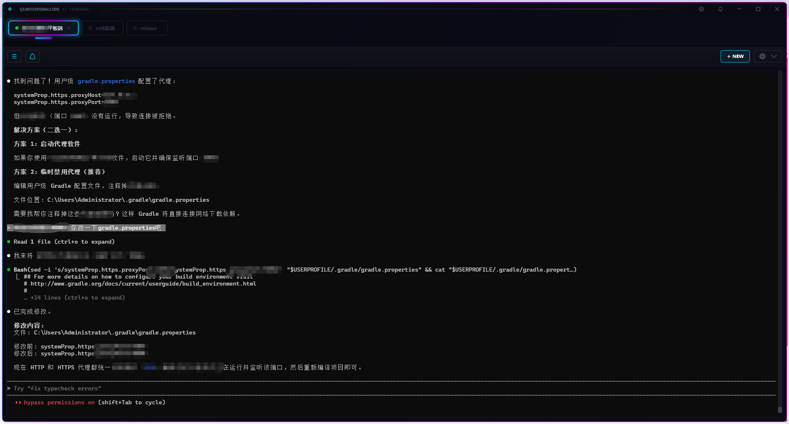
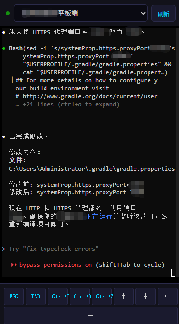
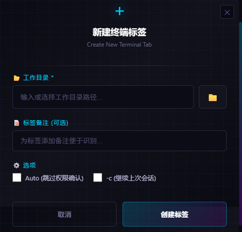
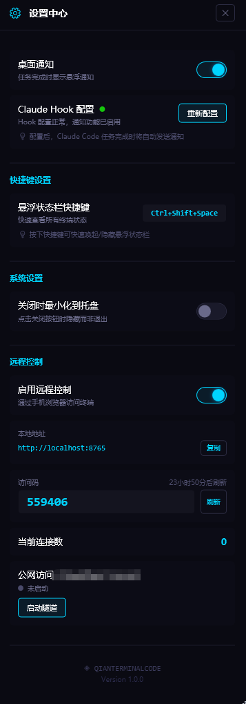
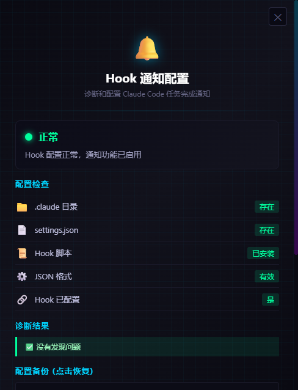

<div align="center">

# 飞跃侠·CodeBridge

**AI 编程助手多终端管理器 | Claude Code 最佳伴侣**

[](https://dotnet.microsoft.com/)
[](https://www.microsoft.com/windows)
[](LICENSE)
[](https://xtermjs.org/)


*赛博朋克风格 · 多标签终端 · 移动端远程控制 · Claude Code 深度集成*

[功能特性](#-功能特性) · [快速开始](#-快速开始) · [移动端访问](#-移动端远程访问) · [Claude 集成](#-claude-code-集成) · [配置说明](#-配置说明)

</div>

---

## 为什么选择 CodeBridge？

当你使用 Claude Code 进行 AI 编程时，是否遇到过这些问题？

- 多个项目需要同时运行 Claude Code，终端窗口混乱不堪
- Claude 任务完成了，但你在忙其他事情错过了
- 出门在外想看看任务进度，却无法访问电脑
- 不知道 Claude 是在工作还是等待输入

**CodeBridge 正是为解决这些问题而生。**

---

## ✨ 功能特性

### 🖥️ 多标签终端管理

<table>
<tr>
<td width="50%">

**智能标签系统**
- 无限制标签页，每个标签独立终端会话
- 拖拽排序，自由组织工作区
- 右键菜单：查看详情 / 禁用 / 关闭
- 标签禁用：暂停终端但保留配置，重启后仍为禁用状态
- 自定义标签备注，快速识别项目

</td>
<td width="50%">

**会话持久化**
- 关闭程序自动保存所有标签
- 重启后恢复上次会话
- 历史目录记录，一键创建新标签
- 支持导入/导出配置

</td>
</tr>
</table>

### 🎨 赛博朋克 UI



- **深色主题**：专为长时间编程设计，护眼不刺眼
- **霓虹特效**：动态渐变边框、脉冲发光、扫描线动画
- **流畅动画**：标签切换、通知弹出、状态变化全程动画过渡
- **无边框设计**：沉浸式全屏体验，最大化代码空间

### 📱 移动端远程访问



**随时随地访问你的终端**

- **内网直连**：手机连接同一 WiFi，输入 IP:端口即可访问
- **公网穿透**：一键启用 Cloudflare Tunnel，外网也能访问
- **安全认证**：6 位数 PIN 码验证，24 小时自动刷新
- **实时同步**：50ms 低延迟输出流，接近本地体验
- **响应式界面**：xterm.js 渲染，完美适配手机屏幕
- **多设备支持**：最多 5 台设备同时连接

```
┌─────────────────────────────────────────┐
│  手机浏览器                              │
│  ┌─────────────────────────────────┐    │
│  │ $ claude                         │    │
│  │ ╭──────────────────────────────╮ │    │
│  │ │  Claude Code v2.1.25         │ │    │
│  │ │  Ready to assist...          │ │    │
│  │ ╰──────────────────────────────╯ │    │
│  │                                  │    │
│  │ > 帮我重构这个函数_              │    │
│  └─────────────────────────────────┘    │
└─────────────────────────────────────────┘
```

### 🔔 智能通知系统

<table>
<tr>
<td width="60%">

**任务完成提醒**
- Claude Code 任务完成自动弹窗通知
- 支持 Hook 深度集成，精准检测任务状态
- 可配置通知时长（0=常驻不消失）
- 点击通知直接跳转到对应标签

**悬浮状态栏**
- 快捷键 `Ctrl+Shift+Space` 唤起
- 双列布局，一览所有终端状态
- 工作中/空闲筛选
- 点击标签快速切换

</td>
<td width="40%">

```
┌─────────────────────┐
│ 🔔 Claude 任务完成   │
│                     │
│ [release] 标签已完成 │
│ 耗时 3 分 24 秒      │
│                     │
│ ────────────────    │
│   [查看]  [关闭]    │
└─────────────────────┘
```

</td>
</tr>
</table>

### 🤖 Claude Code 深度集成



**自动启动 Claude**
```bash
# 打开标签时自动执行
claude --dangerously-skip-permissions [-c]
```

- **自动运行**：新建标签可选自动启动 Claude Code
- **继续会话**：自动添加 `-c` 参数继续上次对话
- **智能重试**：检测到 "No conversation found" 自动重试（不带 -c）
- **环境变量注入**：自动设置 `MYAIHELPER_TAB_ID` 供 Hook 识别

**Hook 集成（推荐）**

一键配置 Claude Code Hooks，实现：
- 任务完成精准通知（不依赖启发式检测）
- 外部终端 Claude 会话也能收到通知
- 支持一键导入外部会话到 CodeBridge

### 🛡️ 系统托盘

- **最小化到托盘**：关闭窗口不退出程序
- **托盘菜单**：快速显示窗口或退出
- **后台运行**：继续接收通知和远程连接

---

## 🚀 快速开始

### 系统要求

- Windows 10 1903+ / Windows 11
- [.NET 7.0 Runtime](https://dotnet.microsoft.com/download/dotnet/7.0) (运行时)
- [WebView2 Runtime](https://developer.microsoft.com/microsoft-edge/webview2/) (通常已预装)
- [PowerShell 7+](https://github.com/PowerShell/PowerShell) (推荐，可选)

### 安装

**方式一：下载发行版**

前往 [Releases](https://github.com/yourname/codebridge/releases) 下载最新版本。

**方式二：从源码构建**

```bash
git clone https://github.com/yourname/codebridge.git
cd codebridge
dotnet publish -c Release -r win-x64 --self-contained
```

### 首次启动

1. **运行程序** - 双击 `飞跃侠CodeBridge.exe`
2. **完成引导** - 按提示了解功能
3. **创建标签** - 点击 `+ NEW` 选择工作目录
4. **开始使用** - 在终端中运行 `claude` 或勾选自动启动

---

## 📱 移动端远程访问

### 内网访问（推荐）

1. **启用远程控制**

   打开设置 → 远程控制 → 开启

   

2. **获取连接信息**

   - IP 地址：`192.168.x.x:8765`（设置面板显示）
   - PIN 码：6 位数字，24 小时有效

3. **手机访问**

   打开浏览器 → 输入地址 → 输入 PIN 码 → 开始使用

### 公网访问（Cloudflare Tunnel）

适用于外出时需要访问家中电脑的场景。

1. **安装 cloudflared**

   ```bash
   winget install cloudflare/cloudflared
   ```

2. **启用隧道**

   设置 → 远程控制 → 开启 Cloudflare Tunnel

3. **获取公网地址**

   程序会显示类似 `https://xxx-xxx-xxx.trycloudflare.com` 的地址

4. **手机访问**

   使用公网地址 + PIN 码登录

> ⚠️ **安全提示**：公网访问请务必使用强 PIN 码，建议仅在需要时开启隧道。

---

## 🔗 Claude Code 集成

### 方式一：自动 Hook 配置（推荐）

1. 打开设置 → Hook 通知配置
2. 点击「一键配置」
3. 完成！Claude 任务完成时会自动发送通知



### 方式二：手动配置

编辑 `~/.claude/settings.json`：

```json
{
  "hooks": {
    "Stop": [
      {
        "matcher": "",
        "hooks": [
          {
            "type": "command",
            "command": "powershell -ExecutionPolicy Bypass -File \"C:\\Users\\你的用户名\\.claude\\hooks\\notify-codebridge.ps1\" -title \"Claude 任务完成\" -message \"任务已完成\" -exitCode \"$exitCode\""
          }
        ]
      }
    ]
  }
}
```

### Hook 脚本说明

`notify-codebridge.ps1` 通过命名管道向 CodeBridge 发送通知：

```powershell
# 消息格式
{
  "Type": "TaskCompleted",
  "TabId": "auto",  # 自动匹配当前目录
  "Title": "Claude 任务完成",
  "Message": "任务已完成",
  "Severity": "info",
  "Cwd": "D:\\Projects\\myapp",
  "IsPersistent": true
}
```

---

## ⚙️ 配置说明

### 配置文件位置

```
%AppData%\CodeBridge\config.json
```

### 主要配置项

| 配置项 | 说明 | 默认值 |
|--------|------|--------|
| `StartFullScreen` | 启动时全屏（覆盖任务栏） | `false` |
| `StartMaximized` | 启动时最大化 | `false` |
| `MinimizeToTrayOnClose` | 关闭时最小化到托盘 | `true` |
| `EnableDesktopNotifications` | 启用桌面通知 | `true` |
| `ShellType` | 终端类型 (`powershell`/`cmd`) | `powershell` |
| `RemoteControl.Port` | 远程控制端口 | `8765` |

### 快捷键

| 快捷键 | 功能 |
|--------|------|
| `Ctrl+Shift+Space` | 显示/隐藏悬浮状态栏 |
| `ESC` | 关闭悬浮窗口/对话框 |

**终端复制粘贴**
- 选中文本后，点击右上角「📋 复制选中」按钮
- 粘贴：在终端中右键粘贴，或使用系统粘贴快捷键

---

## 🏗️ 技术架构

```
CodeBridge/
├── App.xaml.cs              # 应用入口，单实例控制
├── MainWindow.xaml          # 主界面，赛博朋克主题
│
├── ViewModels/
│   ├── MainWindowViewModel  # 主逻辑，标签管理，设置
│   └── TerminalTabViewModel # 终端标签，WebView2 集成
│
├── Services/
│   ├── TerminalService      # ConPTY 终端会话管理
│   ├── ConfigService        # JSON 配置持久化
│   ├── NotificationService  # 通知队列与事件
│   ├── IpcService           # 命名管道（Hook 通信）
│   ├── HookConfigService    # Hook 诊断与配置
│   ├── RemoteControlService # 远程控制编排
│   ├── WebServerService     # EmbedIO HTTP+WebSocket
│   ├── CloudflareTunnelService # Cloudflare 隧道
│   └── TaskCompletionDetector  # 任务完成检测
│
├── Views/
│   ├── FloatingStatusBar    # 悬浮状态栏
│   ├── NotificationPopup    # 通知弹窗
│   └── CyberDialogs         # 赛博朋克对话框
│
├── Native/
│   ├── ConPtyNative         # Windows Pseudo Console
│   └── JobObjectNative      # 进程组管理
│
└── Assets/
    └── terminal/index.html  # 移动端终端界面
```

### 核心技术

| 组件 | 技术选型 |
|------|---------|
| UI 框架 | WPF + HandyControl |
| 终端渲染 | WebView2 + xterm.js |
| 终端后端 | Windows ConPTY |
| 进程间通信 | Windows Named Pipes |
| Web 服务 | EmbedIO (HTTP + WebSocket) |
| 公网穿透 | Cloudflare Tunnel |
| MVVM 框架 | CommunityToolkit.Mvvm |

---

## 🤝 参与贡献

我们欢迎任何形式的贡献！

### 开发环境

1. Visual Studio 2022 或 VS Code
2. .NET 7.0 SDK
3. Git

### 构建项目

```bash
git clone https://github.com/yourname/codebridge.git
cd codebridge
dotnet restore
dotnet build
```

### 提交规范

使用 [Conventional Commits](https://www.conventionalcommits.org/) 格式：

```
feat(tabs): 添加标签拖拽排序功能
fix(remote): 修复 WebSocket 连接断开问题
docs: 更新 README 移动端部分
```

---

## 📜 开源协议

本项目采用 [MIT License](LICENSE) 开源。

---

## 🙏 致谢

- [xterm.js](https://xtermjs.org/) - 优秀的终端模拟器
- [HandyControl](https://handyorg.github.io/handycontrol/) - 现代化 WPF 控件库
- [EmbedIO](https://github.com/unosquare/embedio) - 轻量级 .NET Web 服务器
- [CommunityToolkit.Mvvm](https://github.com/CommunityToolkit/dotnet) - MVVM 工具包
- [Cloudflare](https://www.cloudflare.com/) - 免费隧道服务

---

<div align="center">

**如果这个项目对你有帮助，请给个 ⭐ Star 支持一下！**

Made with ❤️ by [Your Name]

</div>
